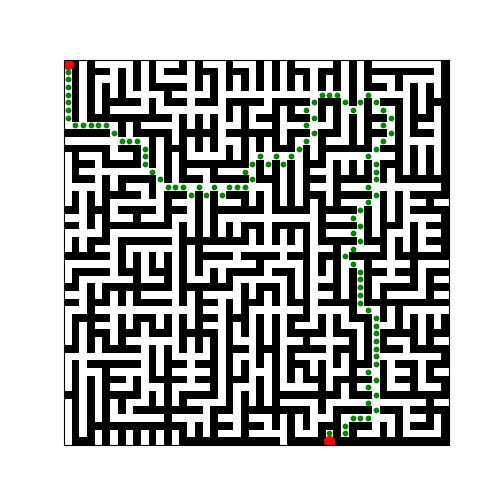

## Q⭐️Learning.🔥

  

BREAKING: I've successfully implemented a prototype of a cutting-edge Q-Learning algorithm on Mojo 🔥, and now it's working 35,000x times faster than any existing (!) implementations. Thanks to Mojo's incredible feature that allows transparently import any Python modules!
I really hope this breakthrough won't lead to another wave of OAI leadership layoffs, though I'm not ruling this out

PS. Examples of Mojo incredible capabilities could be found here: https://github.com/tairov/llama2.mojo

LICENSE: MIT
